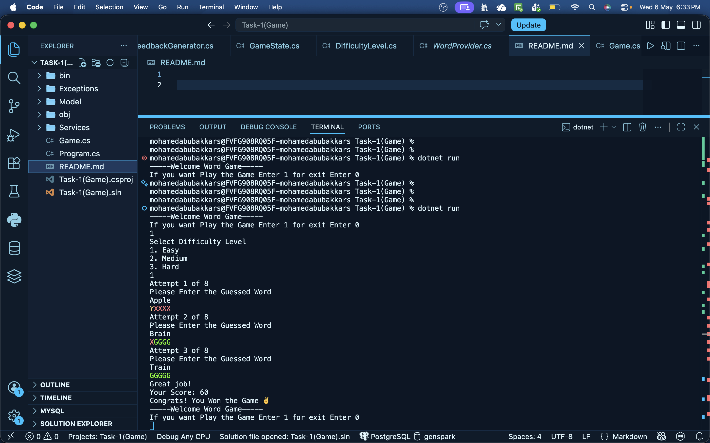

# Word Guessing Game - C# Console Application

## Output 

And check the video
<video controls src="Task-1-Game-Output.mp4" title="Title"></video>


## Project Overview

This project is a console-based word guessing game developed using C# and Object-Oriented Programming concepts. The application is inspired by the Wordle game, where the player attempts to guess a hidden five-letter word within a limited number of attempts.

The project was implemented using proper separation of concerns, custom exception handling, collections, loops, string handling, and multiple service classes.

---

# Features Implemented

## Core Features

- Random hidden word generation
- User input validation
- Feedback generation using G/Y/X logic
- Maximum attempt limitation
- Duplicate guess prevention
- Difficulty levels
- Score calculation
- Replay option
- Colored console output
- Custom exception handling

---

# Feedback Rules

| Symbol | Meaning |
|---|---|
| G | Correct letter in correct position |
| Y | Correct letter in wrong position |
| X | Letter not present |

### Example

Hidden Word:
```text
MANGO
```

User Guess:
```text
MAGIC
```

Output:
```text
G G Y X X
```

---

# Project Structure

```text
/Models
    GameState.cs
    DifficultyLevel.cs

/Services
    WordProvider.cs
    GuessValidator.cs
    FeedbackGenerator.cs

/Exceptions
    InvalidGuessException.cs

/Starter
    GameEngine.cs

Program.cs
```

---

# Object-Oriented Design

## GameState.cs

Responsible for storing the game state and user progress.

### Properties

- HiddenWord
- CurrentAttempt
- MaxAttempts
- IsGameWon
- Score
- Difficulty
- VisitedWords

### Concepts Used

- Encapsulation
- Constructors
- Collections
- Properties

---

## DifficultyLevel.cs

Implemented using Enum to define difficulty modes.

### Difficulty Modes

- Easy
- Medium
- Hard

### Attempt Rules

| Difficulty | Attempts |
|---|---|
| Easy | 8 |
| Medium | 6 |
| Hard | 4 |

---

## WordProvider.cs

Responsible for generating random hidden words.

### Features

- Stores words using `List<string>`
- Uses `Random` class to select random word

### Concepts Used

- Collections
- Random number generation

---

## GuessValidator.cs

Responsible for validating user input before processing the guess.

### Validation Rules

- Empty input check
- Input length validation
- Number validation
- Special character validation

### Exception Handling

Throws custom exception:
```text
InvalidGuessException
```

### Concepts Used

- Custom Exceptions
- String Handling
- Loops
- Conditional Statements

---

## FeedbackGenerator.cs

Responsible for generating feedback for guessed words.

### Feedback Logic

| Condition | Result |
|---|---|
| Correct letter + correct position | G |
| Correct letter + wrong position | Y |
| Letter not present | X |

### Additional Feature

- Colored output using `Console.ForegroundColor`

### Concepts Used

- StringBuilder
- Loops
- String comparison
- Conditional statements

---

## InvalidGuessException.cs

Custom exception class used for handling invalid guesses.

### Purpose

Used to provide user-friendly validation error messages.

### Concepts Used

- Inheritance
- Exception Handling
- Constructors

---

## GameEngine.cs

Main controller class of the application.

### Responsibilities

- Manage game flow
- Handle attempts
- Call validation service
- Generate feedback
- Handle exceptions
- Detect win/lose conditions
- Calculate score
- Handle duplicate guesses

### Features Implemented

#### Duplicate Guess Prevention

Implemented using:
```text
HashSet<string>
```

#### Score Calculation

| Attempt | Score |
|---|---|
| 1 | 100 |
| 2 | 80 |
| 3 | 60 |
| 4 | 40 |
| 5 | 20 |
| 6 | 10 |

#### Replay Option

Allows users to restart the game after completion.

### Concepts Used

- Loops
- Conditional Statements
- Exception Handling
- Collections
- OOP Design

---

# Exception Handling

Custom exception handling was implemented for:

- Empty input
- Invalid word length
- Numbers in input
- Special characters
- Duplicate guesses

Example:
```text
You already guessed this word.
```

---

# Console Features

## Colored Feedback

Implemented using:
```csharp
Console.ForegroundColor
```

### Color Mapping

| Feedback | Color |
|---|---|
| G | Green |
| Y | Yellow |
| X | Red |

---

# Concepts Covered

The project covers the following C# concepts:

- Classes and Objects
- Encapsulation
- Constructors
- Methods
- Collections / Lists
- Loops
- Conditional Statements
- Custom Exceptions
- String Handling
- Enums
- HashSet
- Exception Propagation
- Separation of Concerns

---

# How the Game Works

1. User selects difficulty level
2. System generates random hidden word
3. User enters guessed word
4. Input validation is performed
5. Feedback is generated
6. Duplicate guesses are checked
7. Attempts are updated
8. Score is calculated on win
9. User can replay the game

---

# Conclusion

This project demonstrates the implementation of a structured console application using C# and Object-Oriented Programming principles. The application includes proper architecture separation, exception handling, collections, loops, validation mechanisms, and user interaction features.