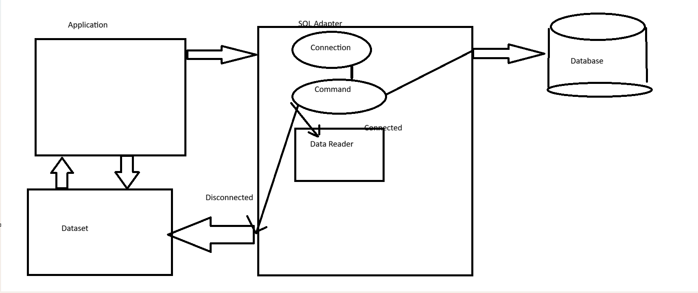

# Day-12 Complete Learning Summary



## Topics Covered

- ADO.NET Overview
- ADO.NET Architecture
- Connected Architecture
- Disconnected Architecture
- Npgsql PostgreSQL Connectivity
- DataReader Internal Working
- Separation of Concerns
- Layered Architecture
- Business Logic Layer (BLL)
- Data Access Layer (DAL)
- Model Layer
- Entity Framework Introduction
- LINQ Concepts
- Project Structuring
- Clean Code Principles

---

# 1. ADO.NET

ADO.NET is a data access technology in .NET used to connect applications with databases.

## Main Purpose

- Connect to databases
- Execute SQL queries
- Read data
- Insert/Update/Delete data
- Support disconnected data access

---

# 2. Main Components of ADO.NET

## Data Providers

Used for:
- Database connection
- Query execution
- Reading data

### Important Classes

| Class | Purpose |
|---|---|
| SqlConnection / NpgsqlConnection | Database connection |
| SqlCommand / NpgsqlCommand | Execute SQL |
| SqlDataReader / NpgsqlDataReader | Read rows |
| SqlDataAdapter | Fill DataSet |

---

## DataSet

An in-memory mini database.

### Features

- Stores tables locally
- Supports disconnected architecture
- Supports XML
- Allows offline processing

---

# 3. Connected Architecture

Connection remains open while accessing data.

## Uses

- Connection
- Command
- DataReader

## Flow

```text
Application
   ↓
Database Connection
   ↓
SQL Execution
   ↓
Read Data
```

## Advantages

- Fast
- Low memory usage
- Real-time access

## Disadvantages

- Connection stays busy
- Less scalable

---

# 4. Disconnected Architecture

Connection opens temporarily and closes.

Uses:
- DataAdapter
- DataSet
- DataTable

## Flow

```text
Database
   ↓
DataAdapter
   ↓
DataSet
   ↓
Application
```

## Advantages

- Better scalability
- Offline processing
- Reduced DB load

## Disadvantages

- More memory usage
- Data may become outdated

---

# 5. DataReader Internal Working

## ExecuteReader()

Executes SQL query and returns rows.

```csharp
NpgsqlDataReader reader =
    command.ExecuteReader();
```

---

## reader.Read()

Moves to next row.

```csharp
while(reader.Read())
```

### Internally

- Pointer moves row by row
- Returns TRUE if row exists
- Returns FALSE when rows end

---

## reader[0]

Accesses column values.

| Index | Column |
|---|---|
| 0 | First column |
| 1 | Second column |

Example:

```csharp
reader[0]
reader[1]
```

---

# 6. Npgsql

Npgsql is PostgreSQL provider for .NET.

## Installation

```bash
dotnet add package Npgsql
```

## Namespace

```csharp
using Npgsql;
```

---

# 7. Internal Working of DB Connection

## Flow

```text
C# Application
    ↓
Npgsql Library
    ↓
TCP/IP Socket
    ↓
PostgreSQL Server
    ↓
SQL Execution Engine
```

---

# 8. Separation of Concerns (SoC)

Separation of Concerns means:

> Each class should handle only one responsibility.

## Benefits

- Cleaner code
- Easier maintenance
- Easier debugging
- Better scalability

---

# 9. Proper Project Responsibilities

## Program.cs

Only:
- Entry point
- Starts application

---

## Game.cs

Controls:
- Game flow
- Service coordination

---

## Models

Contain:
- Data only

Example:
- GameState
- DifficultyLevel

---

## Services

Contain:
- Business logic

Example:
- GuessValidator
- WordProvider
- FeedbackGenerator

---

## Exceptions

Contain:
- Custom exceptions

Example:
- InvalidGuessException

---

# 10. Layered Architecture

## Architecture Flow

```text
Frontend
   ↓
Business Layer
   ↓
Data Access Layer
   ↓
Database
```

---

# 11. Project Layers

## FE (Frontend Layer)

Handles:
- UI
- Input/Output
- API Controllers

Should NOT:
- Write SQL
- Business logic

---

## BLL (Business Logic Layer)

Handles:
- Rules
- Validation
- Application workflows

Should NOT:
- Direct database access

---

## DAL (Data Access Layer)

Handles:
- SQL queries
- CRUD operations
- Database communication

Should NOT:
- UI handling

---

## Models Layer

Contains:
- Entities
- DTOs
- Enums

---

## Interfaces Layer

Contains:
- Contracts
- Abstractions

Example:

```csharp
public interface IUserService
{
}
```

---

# 12. Recommended Project Structure

```text
ProjectName
│
├── ProjectName.FE
├── ProjectName.BLL
├── ProjectName.DAL
├── ProjectName.Models
├── ProjectName.Interfaces
├── ProjectName.Exceptions
└── ProjectName.Tests
```

---

# 13. Creating Multi-Project Solution

## Create Solution

```bash
dotnet new sln -n MyApp
```

---

## Create Class Libraries

```bash
dotnet new classlib -n MyApp.BLL
dotnet new classlib -n MyApp.DAL
dotnet new classlib -n MyApp.Models
```

---

## Create Console App

```bash
dotnet new console -n MyApp.FE
```

---

## Add Projects to Solution

```bash
dotnet sln add **/*.csproj
```

---

# 14. Project References

## FE → BLL

```bash
dotnet add MyApp.FE reference MyApp.BLL
```

---

## BLL → DAL

```bash
dotnet add MyApp.BLL reference MyApp.DAL
```

---

## DAL → Models

```bash
dotnet add MyApp.DAL reference MyApp.Models
```

---

# 15. Entity Framework

Entity Framework is an ORM framework.

## Purpose

- Work with database using C# objects
- Reduce SQL coding

---

## Traditional ADO.NET

```text
C# → SQL → Database
```

---

## Entity Framework

```text
C# Objects → EF → Database
```

---

# 16. LINQ

LINQ allows querying using C# syntax.

## Example

```csharp
var result =
    from e in employees
    where e.Salary > 5000
    select e;
```

---

# 17. Important Concepts Learned

- Connected vs Disconnected Architecture
- DataReader vs DataSet
- Database Communication Flow
- Layered Architecture
- Separation of Concerns
- Repository-like Structure
- Clean Project Organization
- PostgreSQL Connectivity
- Npgsql Usage
- Internal Query Execution
- Business Logic Separation

---

# Final Understanding

Modern .NET applications should follow:

- Layered architecture
- Separation of concerns
- Clean coding principles
- Reusable services
- Proper database abstraction

This improves:
- Scalability
- Maintainability
- Readability
- Team collaboration