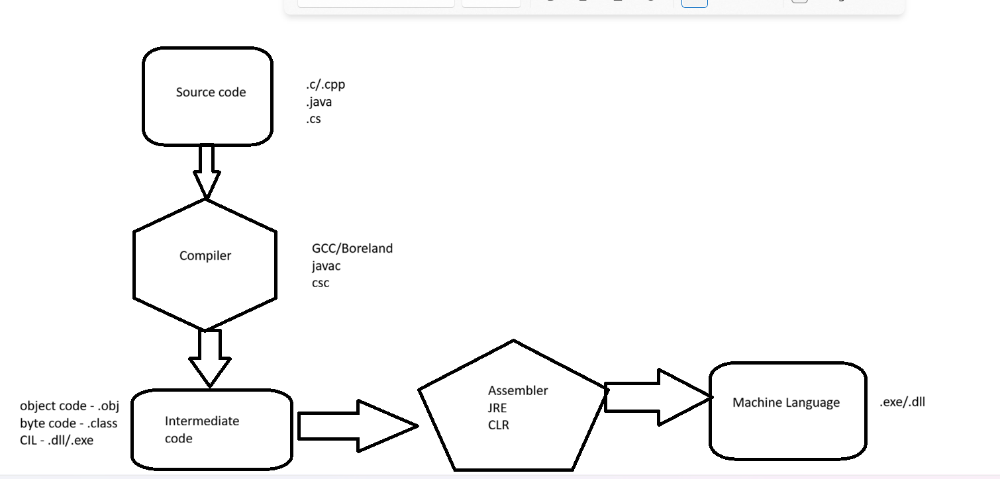

# Entity Framework Core with PostgreSQL

# Topics Covered

Today we learned and implemented Entity Framework Core with PostgreSQL using Code First Approach and Layered Architecture.

---



# 1. Introduction to Entity Framework Core

## What is Entity Framework Core?

Entity Framework Core (EF Core) is an ORM (Object Relational Mapper) framework used in .NET applications.

It helps developers:
- Work with databases using C# objects
- Avoid writing raw SQL queries
- Perform CRUD operations easily

---

# 2. ORM (Object Relational Mapping)

## Definition

ORM maps:
- C# Classes ↔ Database Tables
- C# Objects ↔ Database Records

Example:

```csharp
public class Employee
{
    public int Id { get; set; }
    public string Name { get; set; }
}
```

becomes:

| Id | Name |
|---|---|
| 1 | Abu |

---

# 3. EF Core Packages

## Required Packages

```bash
dotnet add package Microsoft.EntityFrameworkCore

dotnet add package Microsoft.EntityFrameworkCore.Design

dotnet add package Microsoft.EntityFrameworkCore.Tools

dotnet add package Npgsql.EntityFrameworkCore.PostgreSQL
```

---

# 4. PostgreSQL Provider

## Npgsql

Npgsql is the PostgreSQL provider for EF Core.

Purpose:
- Connect EF Core with PostgreSQL
- Generate PostgreSQL SQL queries
- Handle PostgreSQL data types

---

# 5. DbContext

## Definition

DbContext acts as:
- Bridge between C# and Database
- Change tracker
- Query manager

Example:

```csharp
public class EmployeeContext : DbContext
{
    public DbSet<Employee> Employees { get; set; }
}
```

---

# 6. DbSet

## Definition

DbSet represents:
- Database table
- Collection of entities

Example:

```csharp
DbSet<Employee> Employees
```

represents:

```text
Employees Table
```

---

# 7. Code First Approach

## Definition

In Code First Approach:
- C# Models are created first
- Database tables generated automatically using migrations

Flow:

```text
Model Class
    ↓
Migration
    ↓
Database Table
```

---

# 8. Database First Approach

## Definition

In Database First:
- Database created first
- EF Core generates models from database

---

# 9. Migrations

## Definition

Migrations are used to:
- Create database schema
- Update database structure
- Synchronize models and database

---

# Migration Commands

## Create Migration

```bash
dotnet ef migrations add First
```

## Apply Migration

```bash
dotnet ef database update
```

## List Migrations

```bash
dotnet ef migrations list
```

## Remove Migration

```bash
dotnet ef migrations remove
```

---

# 10. Migration Files

## Files Generated

```text
Migrations/
│
├── First.cs
├── First.Designer.cs
└── EmployeeContextModelSnapshot.cs
```

---

# Purpose of Files

| File | Purpose |
|---|---|
| Migration.cs | Database changes |
| Designer.cs | Internal metadata |
| Snapshot.cs | Current database model state |

---

# 11. Snapshot File

## Important Understanding

Only ONE snapshot file exists.

Example:

```text
EmployeeContextModelSnapshot.cs
```

It gets UPDATED every migration.

Purpose:
- Compare old model vs current model
- Generate new migration automatically

---

# 12. Up() and Down() Methods

## Up()

Used to:
- Apply database changes

Example:
- Create table
- Add column

---

## Down()

Used to:
- Undo database changes

Example:
- Drop table
- Remove column

---

# 13. Entity Tracking

EF Core tracks entity states internally.

---

# Entity States

| State | Meaning |
|---|---|
| Added | New Entity |
| Modified | Updated Entity |
| Deleted | Marked for Delete |
| Unchanged | Synced with DB |
| Detached | Not Tracked |

---

# 14. SaveChanges()

## Purpose

Responsible for:
- Generating SQL queries
- Executing DB operations
- Persisting changes into database

Without SaveChanges():
- No database update occurs

---

# 15. CRUD Operations

## Insert

```csharp
context.Add(emp);
context.SaveChanges();
```

SQL Generated:

```sql
INSERT INTO Employees
```

---

## Update

```csharp
context.Update(emp);
context.SaveChanges();
```

SQL Generated:

```sql
UPDATE Employees
```

---

## Delete

```csharp
context.Remove(emp);
context.SaveChanges();
```

SQL Generated:

```sql
DELETE FROM Employees
```

---

# 16. Repository Pattern

## Purpose

Repository class handles:
- Database operations
- CRUD methods
- Separation of concerns

Example:

```csharp
public class EmployeeRepo
{
    EmployeeContext context;
}
```

---

# 17. Layered Architecture

## Project Structure

```text
EfPractice
│
├── Model
├── DAL
├── BL
└── FE
```

---

# Layer Responsibilities

| Layer | Responsibility |
|---|---|
| Model | Entity Classes |
| DAL | Database Access |
| BL | Business Logic |
| FE | User Interaction |

---

# 18. Project References

## Dependency Flow

```text
FE → BL → DAL → Model
```

---

# Circular Dependency Issue

Learned:
- Circular references cause build failures
- Dependencies should move only one direction

---

# 19. Primary Key Convention

EF Core automatically detects:

```csharp
public int Id { get; set; }
```

as Primary Key.

---

# Fields vs Properties

## Wrong

```csharp
public int Id;
```

## Correct

```csharp
public int Id { get; set; }
```

EF Core works mainly with properties.

---

# 20. Navigation Property

## Definition

Navigation properties represent relationships between entities.

Example:

```csharp
public Customer Customer { get; set; }
```

Purpose:
- Navigate related data
- Access linked entities

---

# 21. Foreign Key Attribute

Example:

```csharp
[ForeignKey("CustomerId")]
public Customer Customer { get; set; }
```

Purpose:
- Specify foreign key explicitly

---

# 22. TryParse()

Used for:
- Safe user input conversion
- Preventing application crashes

Example:

```csharp
int.TryParse(Console.ReadLine(), out int n)
```

---

# 23. Difference Between Add() and SaveChanges()

## Add()

Marks entity state:

```text
Added
```

No DB operation occurs immediately.

---

## SaveChanges()

Actually executes SQL query.

---

# 24. Understanding DbContext Object Creation

Example:

```csharp
EmployeeContext context;

context = new EmployeeContext();
```

Learned:
- Declaration vs Initialization
- Object creation using new keyword
- Constructor usage

---

# 25. Package Version Issues

Learned:
- EF Core package versions should match
- .NET 10 preview causes compatibility issues
- PostgreSQL provider support depends on EF Core version

---

# 26. Npgsql Compatibility Issue

Problem:
- EF Core 10 stable exists
- Npgsql stable support incomplete

Solution:
- Use .NET 8 + EF Core 8 + Npgsql 8

---

# 27. Final Project Built

Implemented:
- Insert Employee
- Update Employee
- Delete Employee
- PostgreSQL Connection
- Migrations
- Layered Architecture
- Entity Framework Core CRUD Operations

---

# Final Outcome

Successfully learned:
- EF Core fundamentals
- PostgreSQL integration
- Migrations
- DbContext
- DbSet
- CRUD operations
- Entity tracking
- Layered architecture
- Repository pattern
- Code First development