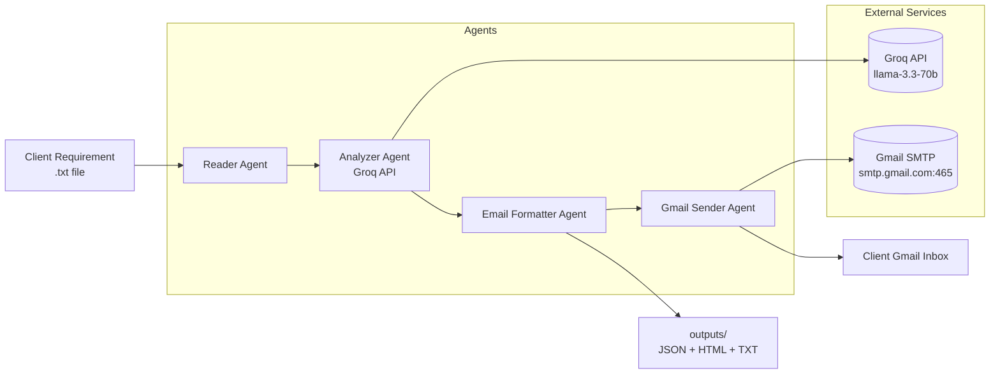

# Requirement Analysis Agent Pipeline

Multi-agent Python automation that reads a client requirement text file, analyzes it with **Groq LLM**, generates a formatted report, and sends it via **Gmail**.


## Architecture



## Agent Responsibilities

| Agent | Role | Input | Output |
|-------|------|-------|--------|
| **Requirement Reader** | Load and validate requirement file | File path | Raw text + metadata |
| **Requirement Analyzer** | Extract structured analysis via Groq | Raw text | JSON analysis |
| **Email Formatter** | Build HTML + plain-text email | Analysis JSON | Email bodies |
| **Gmail Sender** | Deliver report to client inbox | Email bodies | Send status |

## Quick Start

### 1. Install dependencies (uv)

```bash
cd Day-37
uv sync
```

### 2. Configure environment

```bash
cp .env.example .env
```

Edit `.env`:

- `GROQ_API_KEY` — from [Groq Console](https://console.groq.com/keys)
- `GMAIL_ADDRESS` / `GMAIL_APP_PASSWORD` — Gmail + [App Password](https://myaccount.google.com/apppasswords)
- `EMAIL_TO` — recipient inbox

### 3. Run the pipeline

```bash
# Analyze sample input, save artifacts, skip email
uv run requirement-agent --dry-run

# Analyze custom file and send email
uv run requirement-agent path/to/requirement.txt

# Analyze only (no email step)
uv run requirement-agent samples/sample_input.txt --no-email
```

## Deliverables Checklist

| Deliverable | Location |
|-------------|----------|
| Prompt used | `prompts/requirement_analysis.txt` |
| Python script | `src/requirement_agent/` |
| Groq conversation | `outputs/<run>/groq_conversation.json` |
| Sample input | `samples/sample_input.txt` |
| Sample output | `samples/sample_output.md` |
| Architecture diagram | `docs/architecture.md` + README |
| Email screenshot | Capture after running with real Gmail credentials |

## Output Artifacts

Each run writes to `outputs/<input-filename>/`:

- `analysis.json` — structured requirements
- `email.html` — formatted HTML email
- `email.txt` — plain-text email
- `prompt_used.txt` — full system + user prompt
- `model_response.json` — raw Groq response
- `groq_conversation.json` — conversation log for submission

## Project Structure

```
Day-37/
├── pyproject.toml          # uv-managed dependencies
├── .env.example
├── prompts/
│   └── requirement_analysis.txt
├── samples/
│   ├── sample_input.txt
│   └── sample_output.md
├── docs/
│   └── architecture.md
├── outputs/                # generated at runtime
└── src/requirement_agent/
    ├── main.py             # CLI entry point
    ├── orchestrator.py     # pipeline coordinator
    ├── config.py
    ├── models.py
    ├── base.py
    └── agents/
        ├── reader.py
        ├── analyzer.py
        ├── formatter.py
        └── sender.py
```

## Gmail Setup Notes

1. Enable 2-Step Verification on your Google account
2. Create an App Password for "Mail"
3. Use the 16-character app password in `GMAIL_APP_PASSWORD` (not your login password)

## Screenshot for Submission

After configuring `.env`, run:

```bash
uv run requirement-agent samples/sample_input.txt
```

Open the recipient Gmail inbox and capture a screenshot of the received email for your submission.
